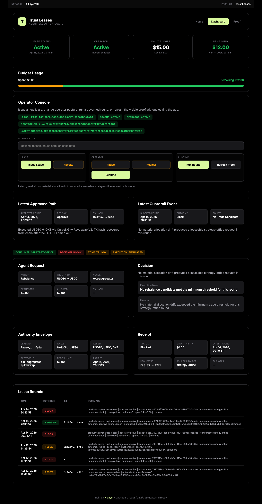
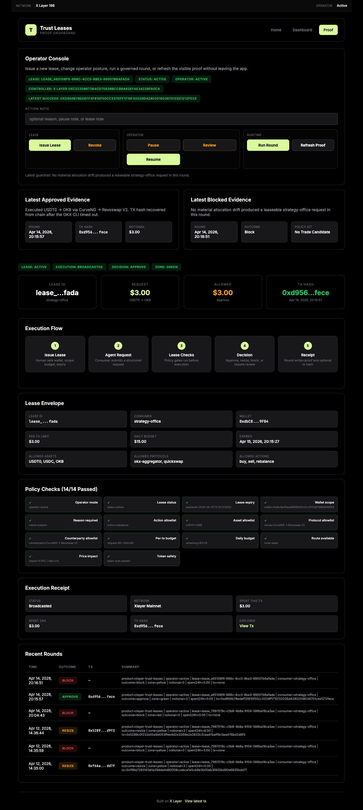
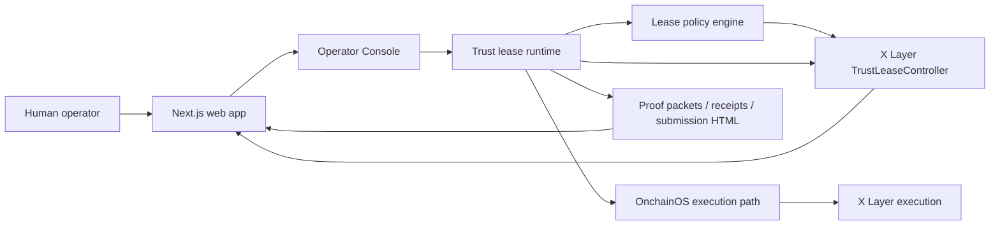
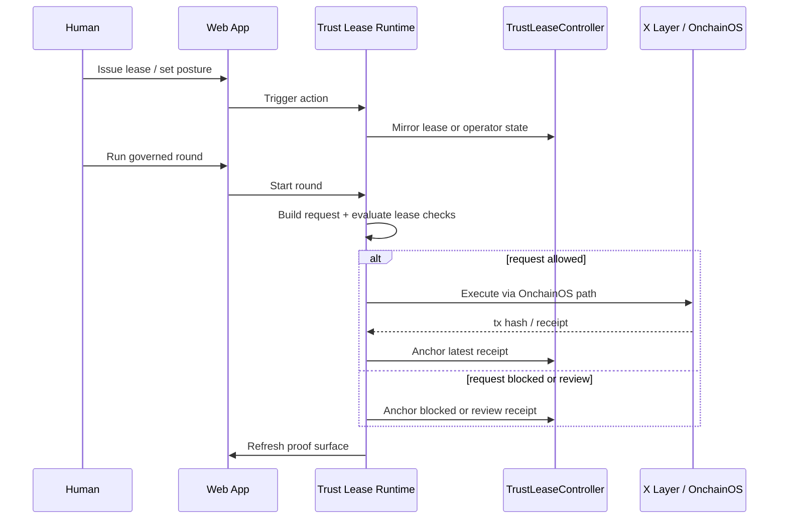

# X Layer Trust Leases


Pre-execution control plane for agent spending on X Layer.

X Layer Trust Leases turns agent authority into an explicit product primitive.

Instead of giving an agent a full wallet or forcing a human to manually approve every action forever, Trust Leases lets a human issue a short-lived execution lease with hard boundaries:

- which wallet the agent can use
- which assets and protocols it can touch
- which counterparties it can trade against
- how much it can spend per action and per day
- when that authority expires
- what proof must come back after execution

This is not another agent dashboard.
It is a contract-backed execution lease desk for live X Layer agents.

## 30-Second Pitch

X Layer Trust Leases is a contract-backed governance layer for autonomous execution on X Layer.

A human issues a lease.
An agent submits a request against that lease.
Trust Leases checks wallet scope, asset allowlist, protocol allowlist, counterparty allowlist, budget caps, expiry, and route quality before anything broadcasts.
Only requests that remain inside the authority envelope can execute on X Layer.

This project is the missing middle between:
- giving an agent a full wallet
- manually approving every action

It now runs as a hybrid product:
- a real web app for operators
- a live execution bridge into `xlayer-strategy-office`
- an X Layer controller contract for lease state, operator posture, and receipt anchors
- a proof surface that shows both approved and blocked paths





## For Judges

| Item | Evidence |
|---|---|
| Track fit | Human Track / X Layer Arena governance primitive |
| Core primitive | Short-lived execution lease for X Layer agents |
| Web surface | `submission` and `proof` routes with in-app Operator Console |
| X Layer contract | [`contracts/contracts/TrustLeaseController.sol`](contracts/contracts/TrustLeaseController.sol) |
| Deployed controller | [`0xc2220b67264cd7582bbccb8a62ef4e34228fa0ca`](https://www.oklink.com/xlayer/address/0xc2220b67264cd7582bbccb8a62ef4e34228fa0ca) |
| Controller owner | `0x3f665386b41Fa15c5ccCeE983050a236E6a10108` |
| Deploy script | [`contracts/scripts/deploy.ts`](contracts/scripts/deploy.ts) |
| Runtime bridge | [`scripts/live-round.ts`](scripts/live-round.ts) |
| Lease issuance bridge | [`scripts/issue-lease.ts`](scripts/issue-lease.ts) |
| Operator posture bridge | [`scripts/operator-command.ts`](scripts/operator-command.ts) |
| Governed wallet | `0xdbc8e35ea466f85d57c0cc1517a81199b8549f04` |
| Latest successful tx | [`0xd956b78edeff2f815f50cc337dff1715f32026d42802518036701cee1212fece`](https://www.oklink.com/xlayer/tx/0xd956b78edeff2f815f50cc337dff1715f32026d42802518036701cee1212fece) |
| Latest receipt anchor tx | [`0x6e5b357ca20ccd6deea39437a3b959b5af299b4115cbb8ae772739b3c4df39b7`](https://www.oklink.com/xlayer/tx/0x6e5b357ca20ccd6deea39437a3b959b5af299b4115cbb8ae772739b3c4df39b7) |
| Latest proof packet | [`data/trust-leases/live-proof-latest.json`](data/trust-leases/live-proof-latest.json) |
| Contract runbook | [docs/CONTRACT_RUNBOOK.md](docs/CONTRACT_RUNBOOK.md) |

## For Hackathon Judges

> **Judge Summary**
>
> - **What this is:** a lease primitive for agent execution on X Layer, not another trading bot
> - **What is bounded:** wallet, budget, assets, protocols, counterparties, expiry
> - **What is different:** governance sits in the pre-execution path rather than only reading logs after the fact
> - **Execution path:** the live `xlayer-strategy-office` round path now reads the trust lease before it can broadcast
> - **Onchain controller:** lease state, operator posture, and receipt anchors can now be mirrored into a dedicated X Layer contract
> - **Human posture:** issue, pause, review, resume, and revoke without giving full wallet access

### Current proof snapshot

| Field | Value |
|---|---|
| Governed wallet | `0xdbc8e35ea466f85d57c0cc1517a81199b8549f04` |
| Active consumer | `strategy-office` |
| Active lease | `lease_a65108f6-666c-4cc5-8be3-99007b6afada` |
| Most recent round | `2026-04-14 12:16:51Z` |
| Latest outcome | `block` |
| Latest execution | `simulated` |
| Latest rationale | `No material allocation drift produced a leaseable strategy-office request in this round.` |
| Latest successful tx | [`0xd956b78edeff2f815f50cc337dff1715f32026d42802518036701cee1212fece`](https://www.oklink.com/xlayer/tx/0xd956b78edeff2f815f50cc337dff1715f32026d42802518036701cee1212fece) |
| Live controller | [`0xc2220b67264cd7582bbccb8a62ef4e34228fa0ca`](https://www.oklink.com/xlayer/address/0xc2220b67264cd7582bbccb8a62ef4e34228fa0ca) |
| Latest receipt anchor | [`0x6e5b357ca20ccd6deea39437a3b959b5af299b4115cbb8ae772739b3c4df39b7`](https://www.oklink.com/xlayer/tx/0x6e5b357ca20ccd6deea39437a3b959b5af299b4115cbb8ae772739b3c4df39b7) |
| Live runtime proof | [`data/trust-leases/live-proof-latest.json`](data/trust-leases/live-proof-latest.json) |
| Live strategy-office proof | [`../xlayer-strategy-office/data/office/live-proof-latest.json`](../xlayer-strategy-office/data/office/live-proof-latest.json) |

### Quick links

| Item | Link |
|---|---|
| Award plan | [docs/AWARD_PLAN.md](docs/AWARD_PLAN.md) |
| Latest proof JSON | [examples/live-proof-latest.json](examples/live-proof-latest.json) |
| Proof dashboard sample | [examples/proof-dashboard.sample.html](examples/proof-dashboard.sample.html) |
| Submission page sample | [examples/submission.sample.html](examples/submission.sample.html) |
| Active lease sample | [examples/active-lease.sample.json](examples/active-lease.sample.json) |
| Latest receipt sample | [examples/latest-receipt.sample.json](examples/latest-receipt.sample.json) |
| Architecture | [docs/ARCHITECTURE.md](docs/ARCHITECTURE.md) |
| Deployment runbook | [docs/DEPLOYMENT_RUNBOOK.md](docs/DEPLOYMENT_RUNBOOK.md) |
| OpenClaw runbook | [docs/OPENCLAW_RUNBOOK.md](docs/OPENCLAW_RUNBOOK.md) |

## Scorecard

| Judging dimension | What this repo shows |
|---|---|
| OnchainOS / Uniswap integration and innovation | Reuses the live OnchainOS-backed X Layer execution path from `xlayer-strategy-office`, then inserts a lease gate before broadcast. |
| X Layer ecosystem integration | Dedicated X Layer controller contract, X Layer wallet scope, X Layer tx proof, and X Layer receipt anchoring. |
| AI interactive experience | Human issues bounded authority, agent requests execution, system evaluates policy, then surfaces approve / resize / block / review in the web app. |
| Product completeness | Web dashboard, proof page, operator console, runtime scripts, local artifacts, contract subproject, deploy script, and runbooks are all in this repo. |

## Why This Project Exists

Current agent infrastructure usually forces one of two bad choices:

1. full wallet access
2. endless manual approval

A trust lease creates a third option:

```text
human issues lease
-> agent requests execution
-> lease verifies scope and budget
-> allowed requests execute
-> receipt and proof come back
```

## Lease Model

Each lease defines:
- wallet scope
- allowed assets
- allowed protocols
- allowed counterparties
- allowed actions
- per-tx budget
- daily budget
- expiry time
- proof requirement

A lease is not permanent delegation.
It is temporary operating authority.

## Proof Table

| Proof layer | What it proves | Artifact |
|---|---|---|
| Lease envelope | Human-defined wallet, budget, protocol, counterparty, and expiry scope exists as an explicit authority object | [examples/active-lease.sample.json](examples/active-lease.sample.json) |
| Request packet | The consumer submits a structured request instead of free-form wallet access | [examples/latest-round.sample.json](examples/latest-round.sample.json) |
| Decision layer | The lease can approve, resize, block, or defer to human review before execution | [examples/live-proof-latest.json](examples/live-proof-latest.json) |
| Receipt layer | Every round writes a receipt with spend, tx hash, and note | [examples/latest-receipt.sample.json](examples/latest-receipt.sample.json) |
| UI surface | Judges can inspect the same proof through a dashboard and submission page | [examples/proof-dashboard.sample.html](examples/proof-dashboard.sample.html) |

## Architecture



## Runtime Sequence



## What Makes It Different

| Typical agent wallet flow | Trust Leases |
|---|---|
| Agent gets broad wallet access | Agent gets a bounded lease |
| Review happens after execution | Governance happens before broadcast |
| Dashboard is read-only | Web app can issue, pause, review, resume, revoke, and run |
| Proof is mostly screenshots or logs | Proof packets, receipts, tx hashes, and contract anchors coexist |
| Chain only sees the final swap | Chain can also see lease state, operator posture, and receipt anchor |

## What Is Reused

This repo deliberately reuses working components from existing live X Layer projects in this workspace:

- `xlayer-strategy-office`
  - OnchainOS CLI integration
  - wallet balance and quote parsing
  - live swap execution path
  - real trust-lease gating before broadcast
  - proof dashboard and submission surface pattern
- `xlayer-agent-control-tower`
  - operator posture model
  - human governance language
  - proof-first submission framing

This is copy-heavy on purpose. The goal is speed plus reliability, not novelty for its own sake.

## Current Workflow

```text
issue lease
-> run strategy-office round
-> strategy-office derives request
-> trust lease checks scope and budget
-> strategy-office quorum continues only if lease allows it
-> optional live X Layer execution
-> strategy-office writes its own proof
-> trust-leases writes the lease packet for the same round
```

## Web Operator Surface

The Next.js app is no longer a read-only proof viewer.

The dashboard and proof routes now include an in-app Operator Console that can:
- issue a lease
- pause operator posture
- move into human review posture
- resume active posture
- revoke the active lease
- run a governed round
- refresh visible proof artifacts

That means the core governance loop is now visible and operable inside the product shell instead of requiring the judge or operator to manually switch to CLI just to demonstrate control.

## X Layer Controller Mode

The project now supports a contract-driven operating mode.

In this mode:
- the Next.js app still provides the web surface
- the live runtime still produces full proof packets and receipts
- lease state, operator posture, and latest receipt anchors can be mirrored into an X Layer controller contract
- the dashboard can read that controller state back and merge it into the current lease/operator surface

The contract subproject lives in `contracts/` and compiles independently from the main Next.js app.

Primary commands:

```bash
npm run contracts:compile
npm run contracts:deploy:testnet
npm run contracts:deploy:mainnet
```

To enable controller sync, set these in `.env.local`:

```bash
LEASE_CHAIN_SYNC_ENABLED=true
LEASE_CONTROLLER_ADDRESS=0x...
LEASE_CONTROLLER_WRITER_PRIVATE_KEY=0x...
LEASE_CONTROLLER_ARTIFACT_BASE_URI=https://your-proof-host.example/trust-leases
```

Once configured:
- `lease:issue` will issue the local lease file and mirror it onchain
- `operator:*` commands will mirror operator posture onchain
- `round:live` will anchor the latest receipt and proof hash onchain
- the app will read active lease, operator mode, and latest anchored receipt from X Layer when available

## Repository Layout

```text
src/
  lease/        lease issuance, storage, and policy checks
  runtime/      main lease round runner and artifact index
  onchainos/    reused OnchainOS CLI wrapper
  portfolio/    reused wallet/quote/execute path
  historian/    proof JSON and HTML rendering
scripts/
  issue-lease.ts
  preflight:treasury
  live-round.ts
  render-proof.ts
contracts/
  contracts/TrustLeaseController.sol
  scripts/deploy.ts
examples/
  active-lease.sample.json
  latest-receipt.sample.json
  latest-round.sample.json
  proof-dashboard.sample.html
  submission.sample.html
```

## Environment

This project is designed to reuse the same local setup as `xlayer-strategy-office` and `xlayer-agent-fight-club`:

- same shared Agentic Wallet address when available
- same X Layer settlement env values
- local machine can use proxy `7890`
- OpenClaw / server should run direct, no proxy

## Commands

```bash
npm install
npm run check
npm run lease:issue
npm run preflight:treasury
npm run round:live
npm run proof:render
npm run status:latest
npm run demo:serve
```

## Documentation

- [Architecture](docs/ARCHITECTURE.md)
- [Deployment Runbook](docs/DEPLOYMENT_RUNBOOK.md)
- [OpenClaw Runbook](docs/OPENCLAW_RUNBOOK.md)
- [Demo Video Script](docs/DEMO_VIDEO_SCRIPT.md)
- [Submission Form Answers](docs/SUBMISSION_FORM_ANSWERS.md)
- [Reference Repos](docs/REFERENCE_REPOS.md)
- [Contract Runbook](docs/CONTRACT_RUNBOOK.md)

## What Submission Review Should Notice

- this is a human-track governance primitive
- it is compatible with existing live X Layer agents
- it moves from post-fact monitoring toward pre-execution control
- it is easy to audit because leases and receipts are explicit files

## Honest Scope

What is already implemented:
- lease issuance
- operator posture
- pre-execution checks
- receipt writing
- proof site generation
- `strategy-office` bridge into the trust lease gate
- reuse of live X Layer execution path
- X Layer controller contract for lease state, operator posture, and receipt anchors
- onchain-aware dashboard merge for lease/operator/receipt state

What still improves the project further:
- multi-agent countersigning like Chorus
- trust score / endorsement layer like Universal Trust
- escrow settlement path for mandate-style work
